# Syntax Features

* [Weighting `+` `-` `(word)0.9`](#weighting)
* [Blend `.blend()`](#blend)
* [Conjunction `.and()`](#conjunction)

<a id="weighting"></a>
## Weighting

Append a word or phrase with `-` or `+`, or a weight between `0` and `2`
(`1`=default), to decrease or increase "attention" (= a mix of per-token CFG
weighting multiplier and, for `-`, a weighted blend with the prompt without the
term).

The following syntax is recognised:

- single words without parentheses: `a tall thin man picking apricots+`
- single or multiple words with parentheses:
  `a tall thin man picking (apricots)+` `a tall thin man picking (apricots)-`
  `a tall thin man (picking apricots)+` `a tall thin man (picking apricots)-`
- more effect with more symbols `a tall thin man (picking apricots)++`
- nesting `a tall thin man (picking apricots+)++` (`apricots` effectively gets
  `+++`)
- all of the above with explicit numbers: `a tall thin man picking (apricots)1.1`, `a tall thin man (picking (apricots)1.3)1.1`. `+` is equivalent to `1.1`, `++`
  is `1.1^2`, `+++` is `1.1^3`, etc; `-` means `0.9`, `--` means `0.9^2`, etc.

You can use this to increase or decrease the amount of something. Starting from
this prompt of `a man picking apricots from a tree`, let's see what happens if
we increase and decrease how much attention we want Stable Diffusion to pay to
the word `apricots`:

<figure markdown>

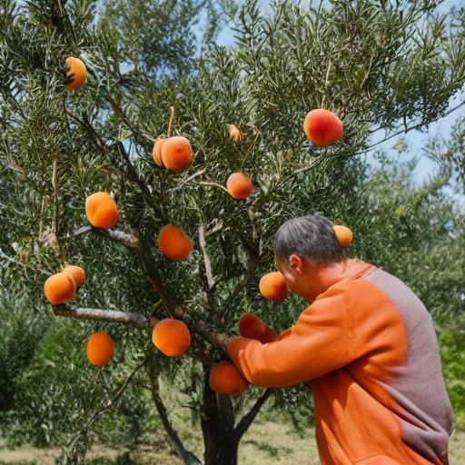

</figure>

Using `-` to reduce apricot-ness:

| `a man picking apricots- from a tree`                                                                                          | `a man picking apricots-- from a tree`                                                                                                        | `a man picking apricots--- from a tree`                                                                                                    |
| ------------------------------------------------------------------------------------------------------------------------------ | --------------------------------------------------------------------------------------------------------------------------------------------- | ------------------------------------------------------------------------------------------------------------------------------------------ |
| 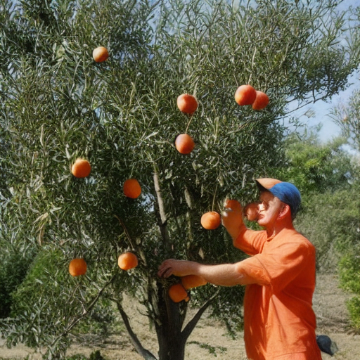 | 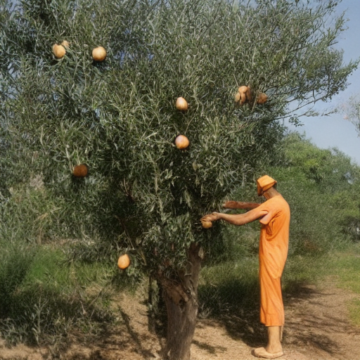 | 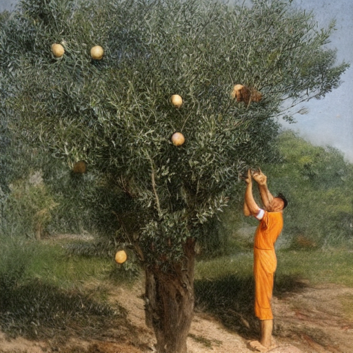 |

Using `+` to increase apricot-ness:

| `a man picking apricots+ from a tree`                                                                                                      | `a man picking apricots++ from a tree`                                                                                                              | `a man picking apricots+++ from a tree`                                                                                                                     | `a man picking apricots++++ from a tree`                                                                                                                                           | `a man picking apricots+++++ from a tree`                                                                                                                                                                           |
| ------------------------------------------------------------------------------------------------------------------------------------------ | --------------------------------------------------------------------------------------------------------------------------------------------------- | ----------------------------------------------------------------------------------------------------------------------------------------------------------- | ---------------------------------------------------------------------------------------------------------------------------------------------------------------------------------- | ------------------------------------------------------------------------------------------------------------------------------------------------------------------------------------------------------------------- |
| 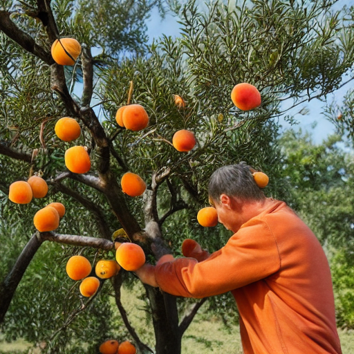 | 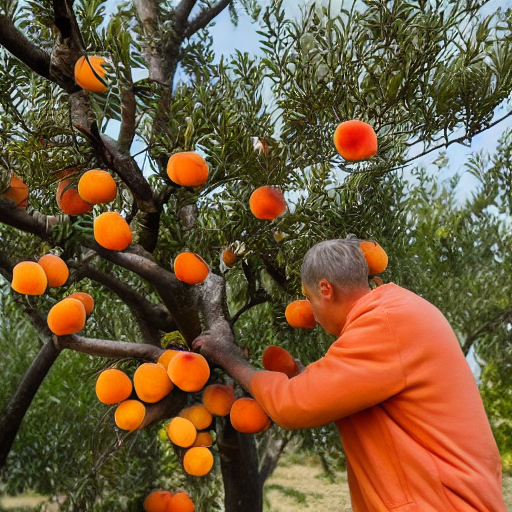 | 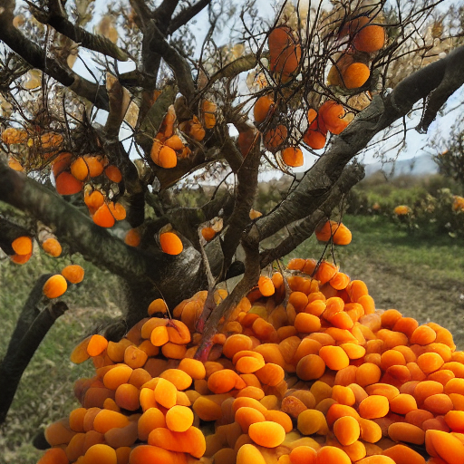 | 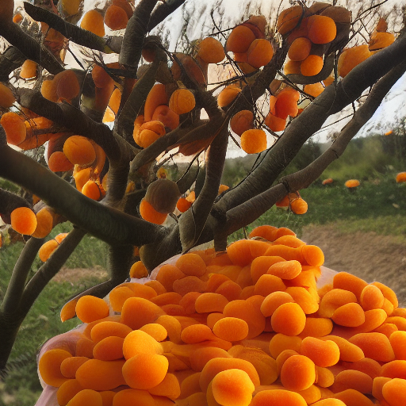 | 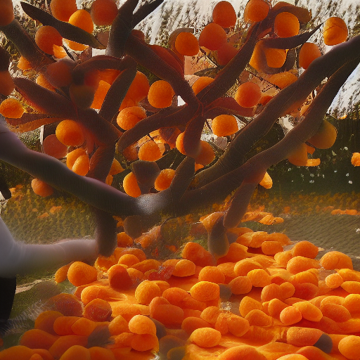 |

You can also change the balance between different parts of a prompt. For
example, below is a `mountain man`:

<figure markdown>


</figure>

And here he is with more mountain:

| `mountain+ man`                                | `mountain++ man`                               | `mountain+++ man`                              |
| ---------------------------------------------- | ---------------------------------------------- | ---------------------------------------------- |
|  |  |  |

Or, alternatively, with more man:

| `mountain man+`                                | `mountain man++`                               | `mountain man+++`                              | `mountain man++++`                             |
| ---------------------------------------------- | ---------------------------------------------- | ---------------------------------------------- | ---------------------------------------------- |
|  |  | 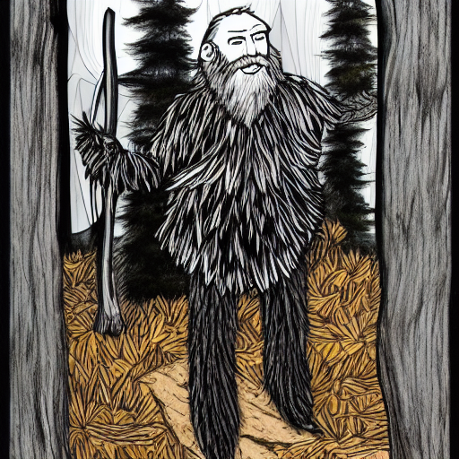 | 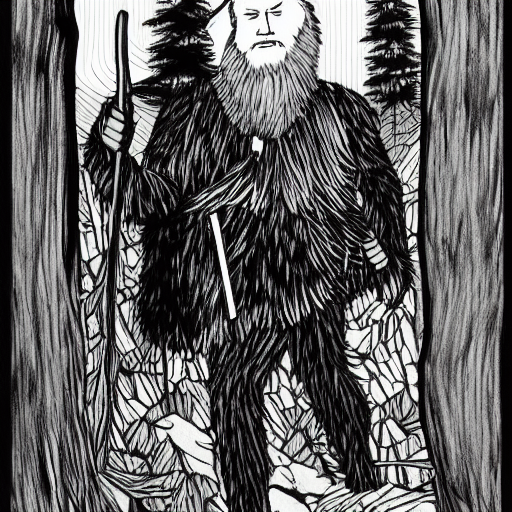 |


<a id="blend"></a>
## Blend

Mathematically merge multiple conditioning by appending `.blend()` to a list of quoted prompts, like this example posted by user @Fortyseven on the InvokeAI discord:

```("spider man", "robot mech").blend(1, 0.8)``` 

| 1                                     | 2                                       | 3                                       |
|---------------------------------------|-----------------------------------------|-----------------------------------------|
|  |  |  |

Note the weights `(1, 0.8)`. Blending breaks some of the assumptions about how the text encoding is supposed to function, so your blends may not come out like you expect. Chaning the weights can have a dramatic effect on how the different parts of the prompt are interpreted, and therefore how the resulting image turns out.

By default weights are normalised, which means you can enter any numbers you want, including negatives, and they will be balanced so that the generation process does not mathematically explode. If you really like to experiment, however, you can pass `no_normalize` to disable this. Probably you'll want to keep the sum of the weights to around `1.0`, but interesting things might happen if you go outside of this range.


<a id="conjunction"></a>
## Conjunction

Break a prompt up into multiple clauses and pass them to CLIP separately by appending `.and()` to a list of quoted prompts, like this: 

```("A dream of a distant galaxy, by Caspar David Friedrich, matte painting", "trending on artstation, HQ").and()```

<figure markdown>


</figure>

For comparison, here is the same prompt as a single string without using `.and()`:

```A dream of a distant galaxy, by Caspar David Friedrich, matte painting, trending on artstation, HQ```

<figure markdown>


</figure>

The difference is subtle, but I for one prefer the `.and()` version.

